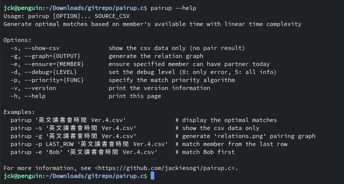
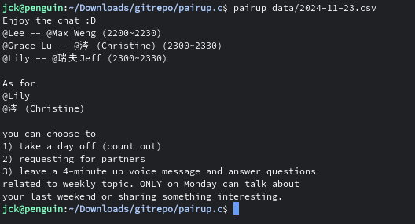
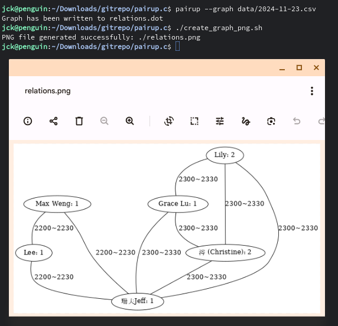

# pairup.c

`pairup` is a command-line tool that finds **optimal pairing results** for English study group by testing multiple prioritization strategies. (first row on sheet, earliest availability, most partners, etc.)

For more information about the prioritization strategies, see [here](https://github.com/jackiesogi/pairup.c/blob/master/src/pairup/pairup-algorithm.c#L21-L69).



## Features
### Show the pair result



### Show the relation graph



## How to build

### Ubuntu 22.04

- Install the required packages.
```bash
sudo apt-get install build-essential make git cmake
```

- Clone the repository.
```bash
git clone https://github.com/jackiesogi/pairup.c.git
cd pairup.c
```

- Run `make` to build the program.
```bash
(mkdir -p build; cd build; cmake ..; make)
```

- Run `get-today-google-sheet.sh` to get the latest sheet (`pairup` will need the csv file it fetched).
```bash
./get-today-google-sheet.sh
```

- The main program `pairup` we built is located in project root.
```bash
./pairup --help
```

### Windows 10/11

- Install `Visual Studio`, `cmake`, `git`

- Clone the repository.
```bash
git clone https://github.com/jackiesogi/pairup.c.git
cd pairup.c
```

- Configure
```bash
mkdir build; cd build
cmake ..; cd ..
cmake --build build --target main
```
After successful build, you'll see `pairup.exe` in the root directory.
